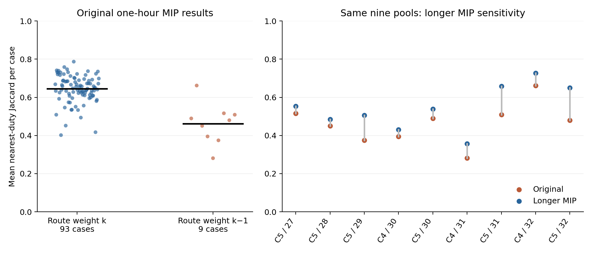

# F2 — selected routes versus original GIRO duties

**P0 item 4 completed.** This is a read-only audit of the frozen 102 original MIP results and 26 longer MIP results identified in the review. No solver was run.

## Findings

| F2 claim tested | Result | Evidence |
|---|---|---|
| The original nine cases with fractional route weight `k−1` have worse integer incumbents. | **VERIFIED** | Original incumbents are 29, 34, 35, 39, 37, 40, 36, 34, 37, respectively. These are 3–10 above their recorded fractional weights. |
| Selected routes are more similar to GIRO duties in the `weight=k` group. | **VERIFIED**, descriptive association | Mean of each case's mean nearest-duty Jaccard: **0.644 versus 0.462**. Restricting to k27–32 gives **0.670 versus 0.462**. |
| Routes in the `weight=k` group are generally near-identical to GIRO duties. | **REFUTED as a blanket description** | Case means range **0.402–0.787**, median 0.649. Only **256/2,228 routes (11.5%)** exactly match a GIRO trip set; 32.1% have Jaccard ≥0.9. This is a mixture, not uniformly near 1. |
| Uniformly low Jaccard would refute any contribution from inherited GIRO structure. | **That proposed test outcome did not occur** | A substantial subset has high overlap, while many routes mix trips from multiple duties. |
| GIRO-like reassembly causes the fleet recovery and the difficult integer cases. | **UNRESOLVED** | Jaccard alone does not identify causality, source-column genealogy, or the role of MIP search. Both sets share nested inputs, and the nine `k−1` cases all belong to chains 4/5 at k27–32. |
| An LP route weight below k prevents this method from matching k. | **REFUTED if read as a deterministic claim** | Longer searches on the same pools match **C5 k31, C4 k32 and C5 k32**, despite route weights k−1. Their pool bounds remain k−1, so these are not proofs of fleet optimality. |

The original review's stronger assertion that an LP fractional solution at k−1 means an integer fleet below k is possible does **not follow mathematically**. A fractional solution does not establish integer feasibility. Also, recorded route weight belongs to a weighted-objective restricted master; it is not automatically a certified fleet-only model lower bound. This audit labels the groups by **recorded fractional route weight**, not by proved integer optimum.

## Summary

Case averages give each instance equal weight; route averages give each selected bus equal weight. The first two rows are the primary comparison. Longer MIPs are a separate sensitivity analysis, not replacements silently mixed into the original table.

| Search | Recorded route-weight group | Cases | Selected routes | Mean case Jaccard | Median route Jaccard | Exact GIRO trip sets | Mean GIRO duties contributing trips to one route |
|---|---|---:|---:|---:|---:|---:|---:|
| Original one-hour MIP | k | 93 | 2,228 | 0.644 | 0.727 | 256 (11.5%) | 3.59 |
| Original one-hour MIP | k−1 | 9 | 321 | 0.462 | 0.329 | 13 (4.0%) | 5.93 |
| Longer MIP, three-hour fleet budget | k | 17 | 503 | 0.652 | 0.727 | 60 (11.9%) | 3.70 |
| Longer MIP, three-hour fleet budget | k−1 | 9 | 289 | 0.545 | 0.552 | 29 (10.0%) | 5.21 |

Each left-hand point is one original experiment, with a black line at its group mean. Right-hand points compare the same nine pools before and after longer MIP search. These are descriptive plots; nested experiments are not independent statistical replicates.

## Definition and validation

For selected route trip set R and GIRO duty trip set G, `J(R,G)=|R∩G|/|R∪G|`. Report the maximum over the k complete GIRO duties in that instance. Tied duties are ordered lexicographically. This compares **trip membership only**, not charging, trip sequence, or physical feasibility.

Mapping is explicit: the saved route's `trips` field uses `count_trip_id`; the instance CSV maps it to `Ordered_Trip_ID`; the frozen original `Par_VehicleDetails_Updated.csv` maps that ID to `VehicleTask`. The audit asserts all 987 regular IDs are unique, every instance is exactly a union of k complete GIRO duties, and all selected schedules cover their full input trip set. It retains every selected route and every repeated trip across routes; it does not deduplicate or repair coverings.

All 128 remote MIP result byte hashes match the frozen source tables. Each input hash matches both the corresponding source table and the MIP's recorded physical-pool audit. The canonical selected-route-set and column-journal hashes are retained. These checks verify source identity and mapping, not the adequacy of the physical model.

A lower fractional objective can coexist with a harder integer search: the useful columns may combine fractionally without combining into a small integer fleet. Thus the review's statement that genuine search should not fail when the LP improves is not a valid implication.

More buses tend to make smaller routes, mechanically reducing trip-set Jaccard even without a causal change in the search method. Duplicate trip coverage, route length, input size, and shared nested duty sets can also affect overlap. No independence-based p-values or causal conclusions are appropriate from this split alone. A random-trip grouping control and comparisons within the same input/pool are more informative for F5.

## Reproduction and source files

- `audit.py`: reads native remote result files and recomputes the analysis. Subsequent runs reuse the saved selected-trip-set snapshot.
- `selected_trip_sets.json`: compact extraction from all 128 native results, including paths, SHA-256 hashes, route indices, original trip IDs, route origins and inherited-source IDs when recorded.
- `per_route.csv`: all **3,341** selected routes, including mapped ordered IDs, nearest duty, intersection/union sizes, Jaccard and mixing count.
- `per_case.csv`: all 128 cases, including duplicates, source identity and overlap summaries.
- `group_summary.csv`: four aggregate rows.
- `provenance.json`: review, script, source-table, original-master, input and output hashes.
- `plot.py`, `jaccard_comparison.png`, `jaccard_comparison.svg`: reproducible figure and editable vector export.

Frozen source tables: `outputs/overnight_next_20260914/status_20260916T194843Z/{all_chain_extension_results,longer_gap_results}.csv`. Original master and all instance CSVs: `outputs/chain_extension_20260913/inputs/`. Review source: `outputs/independent_review_20260916/REVIEW.md`.
