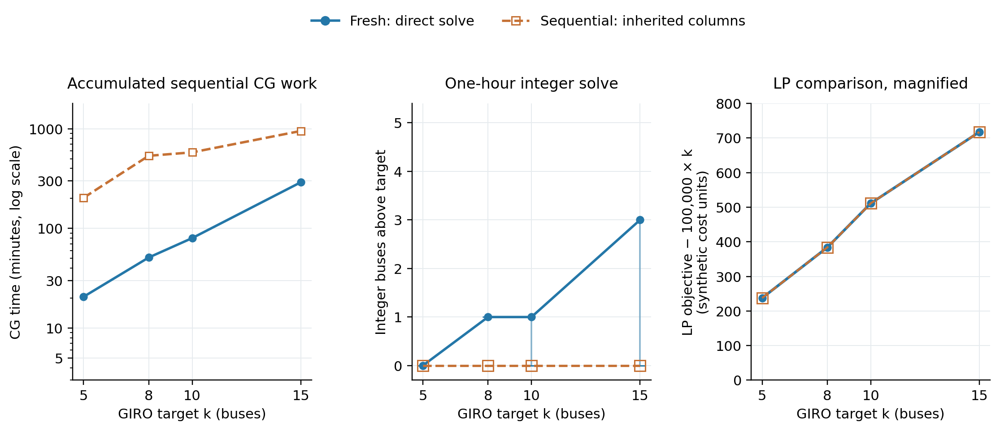

# Follow one chain as the GIRO target grows

The paired data exist at **k = 5, 8, 10 and 15**, for all six chains. These figures reorganize the same audited 24 cases by chain; they do not add new solver runs or invent intermediate fresh results.

Read the panels from left to right:

1. **Computation:** blue is the time for a fresh CG solve at that target. Orange adds every sequential ancestor's CG time through that target. Graph construction, MIP and queue time are excluded; graph costs remain available in the CSV. The vertical axis is logarithmic.
2. **Integer outcome:** buses above the GIRO target after the same one-hour two-stage MIP allowance. The faint vertical segments extend down to the finite-pool fleet bound. They are not error bars. A zero-length segment at +1 means the pool provably needs one extra bus.
3. **LP comparison:** subtract the common 100,000 × k fleet-cost term from both weighted LP objectives, so the charging-related part is visible. This subtraction is a display zoom, not a constraint violation or a reduced cost. Fractional route weight equals k to numerical precision in all these cases, so the remainder is the LP's electricity-plus-start-fee component to within rounding noise. The blue and orange curves coincide.

| Chain 1 target | Fresh CG minutes | Sequential cumulative CG minutes | Fresh integer buses | Sequential integer buses | Both weighted LP objectives, rounded |
|---:|---:|---:|---:|---:|---:|
| 5 | 20.6 | 203.2 | 5 | 5 | 500,237.506 |
| 8 | 51.1 | 536.5 | 9 | 8 | 800,383.688 |
| 10 | 80.0 | 580.8 | 11 | 10 | 1,000,511.205 |
| 15 | 290.7 | 952.3 | 18 | 15 | 1,500,717.373 |

## How close are the LPs?

Across all 24 pairs, the largest absolute weighted-objective difference is **0.0000010617 cost units**, for C2 k15, whose objective is about 1.5 million. The maximum relative difference is **7.08 × 10⁻¹³**, or **0.0000000000708%**. The largest difference in fractional route weight is **2.84 × 10⁻¹³ buses**. They are numerically indistinguishable; this does not mean their route supports or integer pools are identical.

All 48 endpoints stopped with a pricing certificate for the **conservative event-grid model**, using reduced-cost tolerance 0.0001. The most negative recorded final reduced costs are −0.00006594 for fresh and −0.00009096 for sequential. Therefore “certified” here means numerical convergence under that tolerance, not exact arithmetic or optimal continuous charging. The exact model's optimal objective is independent of initialization; different optimal fractional combinations and different saved integer pools remain possible.

The comparison uses 240 kWh / 240 kW, zero reserve, no shared charger capacity or terminal-energy floor, flat tariff, start fee 5, covering, and a 2.5 kWh / 5-minute event grid. Historical code and hardware differ, so these elapsed times are descriptive and not a controlled causal speedup claim. Fresh was allowed the accumulated sequential CG budget and finished before using it. MIP allows up to 30 minutes for fleet search and the remainder of a one-hour total for charging.

## Figures and data

[All chains](all_chains_comparison.png) · [Chain 1](chain1_comparison.png) · [Chain 2](chain2_comparison.png) · [Chain 3](chain3_comparison.png) · [Chain 4](chain4_comparison.png) · [Chain 5](chain5_comparison.png) · [Chain 6](chain6_comparison.png). Every figure has matching PDF and SVG files; SVG text remains editable.

[Exact values, bounds, costs, timings and source paths](chain_comparison.csv) · [LP similarity summary](lp_similarity.json) · [Rebuild script](build.py) · [469 source/settings/proof checks and hashes](provenance.json).
