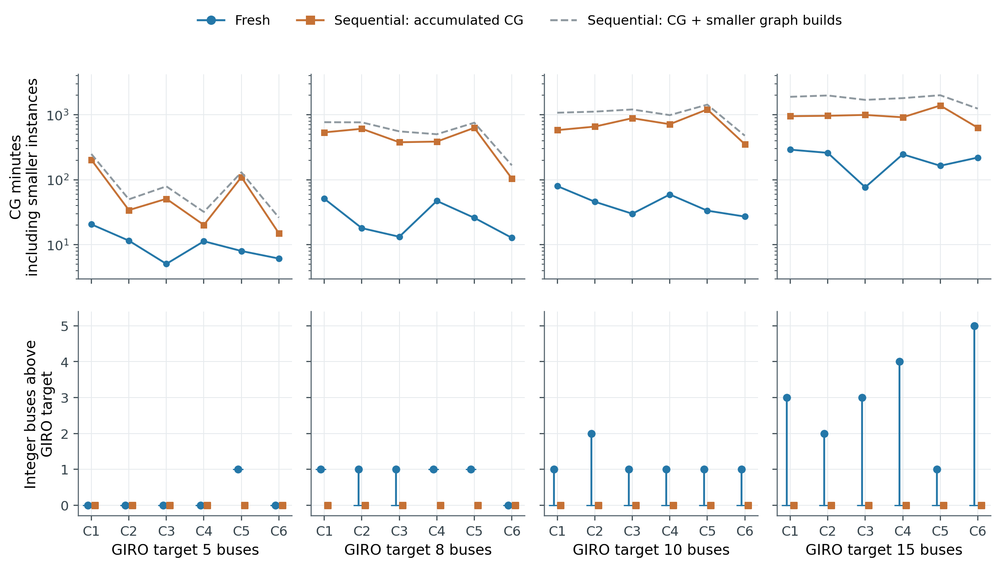
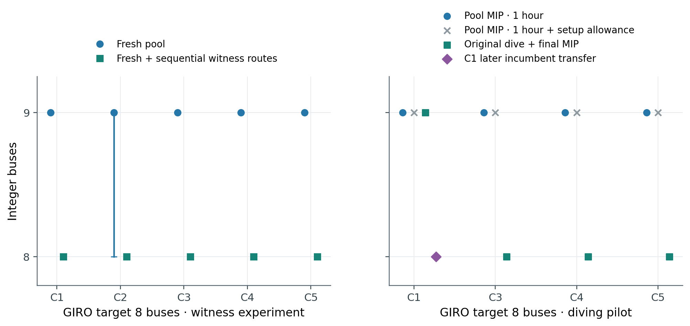
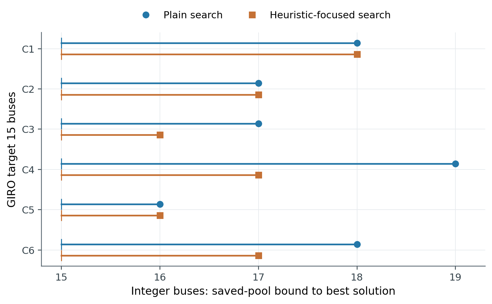
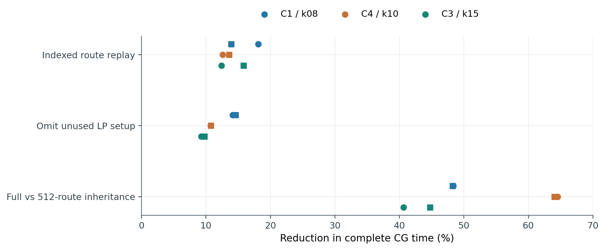
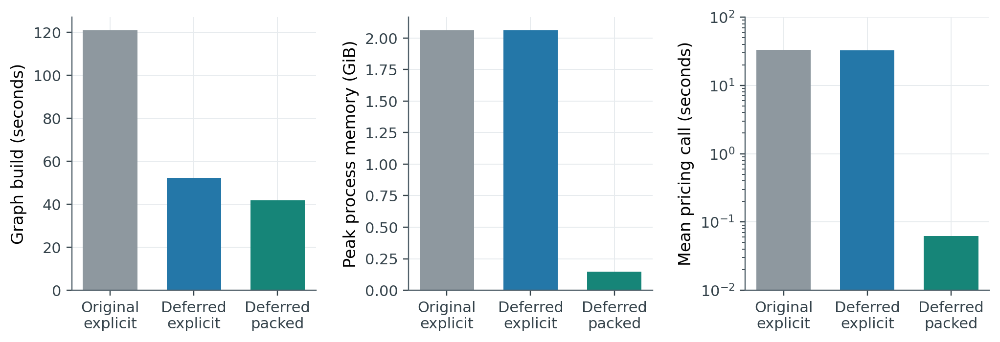

# Paper results preview — 21 September 2026

**The current evidence supports a paper about integer-useful columns, with a separate algorithm-engineering result.** Fresh CG certifies the weighted LP efficiently but often leaves an inferior integer pool; sequential inheritance and directed enrichment recover useful whole-route combinations. Large-case strict physics and charging economics remain separate research questions.

All five figures have **PNG, PDF and editable-text SVG** versions and adjacent CSV data. Titles, claims and captions below stay editable outside the images. These are reanalyses of existing evidence, with no new optimization. [Rebuild script](build_figures.py) · [Source hashes, settings and 268 checks](provenance.json).

[Plain-language guide to Figures 2–5](../../research_management_20260922/figure_explanations/README.md) explains the labels and original budgets.

## 1. A pricing certificate does not guarantee a useful integer pool

**Claim:** On the fixed 24-case panel (six chains × k=5,8,10,15), fresh and sequential endpoints both have pricing certificates. With the same one-hour pool-MIP allowance, fresh attains 6/24 GIRO targets; sequential attains 24/24.

**Caption:** Upper panels show measured fresh CG time and accumulated sequential CG work from k=2 through the target, with smaller-instance graph construction as an additional sensitivity. Fresh received the rounded-up accumulated CG allowance and certified before exhausting it in every case. The common target graph is excluded from both curves and retained in the CSV. Lower markers show integer fleet excess; vertical segments extend to saved-pool fleet bounds. Zero-length segments indicate a proved pool optimum. New [exact time-and-travel certificates](../../independent_review_20260922_opus55/followup_response/README.md) also establish all 24 sequential fleets as minimum fleets in the baseline covering model; an above-target fresh pool optimum remains only pool-optimal. Charging-cost optimality does not follow. MIP time is separate: 3,600 s total, at most 1,800 s for fleet search, remaining time for charging. Cases share inputs and model settings, but historical CG code/hardware variation prevents a clean causal runtime comparison. Sequential growth adds complete GIRO duties: it uses reference-informed trip grouping, without injecting GIRO route columns. Ancestor MIPs, queue time and unrelated failed/tuning runs did not produce the inherited pools and are excluded.

[Data and exact LP objectives](figure1_paired_budget.csv) · [PDF](figure1_paired_budget.pdf) · [SVG](figure1_paired_budget.svg)

## 2. Missing whole routes explain four k8 pool gaps

**Claim:** Four fresh k8 pools provably require nine buses; appending eight sequential witness routes restores eight. The fifth fresh pool (C2) remains open at 9/8 before enrichment; seven additional routes restore eight there. Directed pricing independently recovers eight in three of four original pilot final MIPs.

**Caption:** Left: five selected fresh pools, with bound-to-incumbent segments. Right: four selected pilot cases, two unchanged-pool controls and the original dive-plus-MIP result. C1's later transfer of its own dive incumbent is additional work, shown separately; it is not a fourth original-pilot success. The original C1 treatment took 3,692 s and exceeded a strict one-hour end-to-end limit. Treatment pricing used no sequential/GIRO witness. These are selected diagnostics, not population success rates. All plotted final solutions pass individual replay; exactly-once dispatch and shared station capacity are not jointly established.

**Mechanism:** Across the five k8 LPs, weight eight is spread over 80–101 positive, fractional routes. Of 40 witness routes, 39 trip sets are missing, 37 have positive final reduced cost above 1e-4, and 34 are tagged inherited. Thus final LP pricing need not favor the whole routes that complete an integer cover. These observations do not identify a unique combinatorial obstruction.

[Witness data](figure2_k8_witness.csv) · [Mechanism data](figure2_k8_mechanism.csv) · [Pilot timing](figure2_k8_pilot.csv) · [Separate C1 follow-up](figure2_c1_followup.csv) · [PDF](figure2_k8_column_enrichment.pdf)

## 3. More time on unchanged k15 pools has not closed the gap

**Claim:** Twelve 12-hour fleet searches on six existing fresh pools return 16–19 buses; every bound remains 15.

**Caption:** Segments run from saved-pool fleet bound to incumbent. Plain and heuristic-focused settings use the same six hashed pools, seed 0 and eight threads; these are two searches per case, not twelve independent instances. All fleet stages exhaust 43,200 s; subsequent charging stages also finish. No run proves that 15 is absent. This supports prioritizing new columns, but does not establish a k15 pool integrality gap.

[Data, proof lines and full-log paths](figure3_k15_12h.csv) · [PDF](figure3_k15_open_bounds.pdf)

## 4. Controlled implementation changes reduce complete CG time

**Claim:** Indexed replay reduces CG time by 12.4–18.1%; omitting unused LP setup by 9.3–14.6%. Full rather than 512-column inheritance saves 40.6–64.5% and improves tested fleets 9→8, 11→10 and 17→15.

**Caption:** Three frozen cases, with two reversed execution-order repetitions per contrast (circle/square); repeats are not new cases or seed replicates. Index/setup contrasts preserve the inherited initial pool, iteration counts and certified objectives. Full inheritance intentionally changes the pool, so its effect includes composition and trajectory. Times are target-step CG only, not accumulated chain cost. Execution-order repetition does not eliminate variation across cluster allocations; report these measured effects without treating them as hardware-independent guarantees. Six original full-scan/full-pool arms exhausted the overall two-hour CG budget during import (the separate import timer was disabled) and are retained in the CSV; they are excluded from percentage-speedup points because they never obtained comparable certified endpoints.

[All 24 allocations and source identities](figure4_controlled_algorithms.csv) · [PDF](figure4_controlled_algorithms.pdf)

## 5. Packed graphs remove a measured small-case bottleneck

**Claim:** On one 26-trip strict-physics case, packed storage and pricing give 2.90× faster graph construction, 14.1× lower peak process memory and 530.8× faster mean pricing than the original explicit graph.

**Caption:** Same input, node and event lattice; five deterministic fixed dual vectors, identical minimum reduced costs, and all 15 physical route replays passing. Deferred tie keys alone give 2.32× faster construction. The packed comparison combines compact storage, dominated-edge removal and a vectorized shortest-path scan; its full speedup cannot be attributed to storage alone. Pricing uses a logarithmic axis. No shared-capacity duals are present. This is one implementation benchmark, not five instances, a complete CG solve, a large-case scaling result or a fleet certificate.

[Metrics](figure5_packed_benchmark.csv) · [PDF](figure5_packed_benchmark.pdf)

## Remaining experiments that can change the paper

1. **Integer enrichment:** matched-budget fresh-pool enrichment versus unchanged-pool search; transfer every validated dive incumbent, account for graph/input overhead, and preserve the original pilot.
2. **Larger strict model:** the packed recovery has now completed 2,453 CG iterations at 3.934 GiB, but its nine-duty subgroup has pool optimum 10, no pricing certificate and failed omitted-capacity checks. [Verified endpoint and new successor/benchmark tests](../operations/README.md). Shared-capacity pricing needs separate evidence; the five figures above retain their original frozen cohorts.
3. **Economic value:** compare fixed-duty and joint scheduling under identical physics, tariffs, energy floors and dispatch validation. Existing saved fee0/fee5 schedules have different sequences and station paths, so their differences cannot identify a fee-only effect. A fixed-sequence fee control answers a narrower charging question.

The baseline in Figures 1–4 is set covering, 240 kWh/240 kW, zero reserve, 2.5 kWh/5-minute grid, flat tariff, charge-start fee 5, with no terminal floor or shared capacity. CG minimizes 100,000 × fractional route weight plus charging-related cost. **Weighted LP objective, fractional route weight and fleet-only bounds are different quantities.** The data keep them separate. No uncertified RMP is used as a full-model bound.
